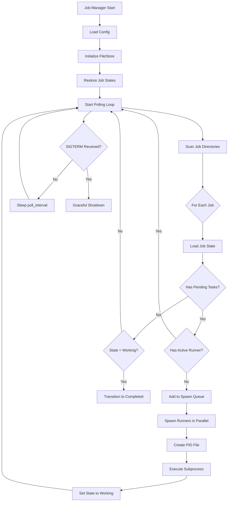

# Design Document: Job Manager MVP

## Overview

The Job Manager MVP implements the core orchestration engine for Air-Executor, providing automated job monitoring, ephemeral task runner lifecycle management, and dynamic task queuing. The design emphasizes simplicity, reliability, and clear separation of concerns to enable future extension for Airflow and Prefect orchestrators.

## Steering Document Alignment

### Technical Standards (tech.md)
- **Python 3.11+**: All code uses modern Python features (match statements, type hints, dataclasses)
- **Structured Logging**: structlog used throughout for consistent, queryable logs
- **Pydantic Models**: All configuration and data models use pydantic for validation
- **Testing**: pytest with >80% coverage target, integration tests for critical flows

### Project Structure (structure.md)
- **Module Organization**: Core models in `core/`, manager logic in `manager/`, CLI in `cli/`
- **Naming Conventions**: `snake_case` for modules/functions, `PascalCase` for classes
- **Import Patterns**: Standard → third-party → local, no circular dependencies
- **Code Size**: Functions <50 lines, files <500 lines, clear single responsibilities

## Code Reuse Analysis

### Existing Components to Leverage
- **None (New Project)**: This is the initial implementation, establishing patterns for future features

### Patterns to Establish for Reuse
- **BaseRunner Protocol**: Abstract interface for task execution, enabling Airflow/Prefect implementations
- **FileStore**: Generic file-based storage that can be extended for database backends
- **SubprocessUtils**: Reusable process management utilities for runner control
- **ValidationUtils**: Reusable validators for job names, task IDs, configuration

## Architecture

The Job Manager follows a layered architecture with clear separation between domain models, business logic, and infrastructure concerns:

```
┌─────────────────────────────────────────┐
│          CLI Layer (cli/)               │
│  Command parsing, output formatting     │
└─────────────────┬───────────────────────┘
                  │
┌─────────────────▼───────────────────────┐
│      Manager Layer (manager/)           │
│  Poller, Spawner, Configuration         │
└────┬──────────────────────────┬─────────┘
     │                          │
┌────▼──────────┐    ┌──────────▼─────────┐
│ Core (core/)  │    │ Storage (storage/) │
│ Job, Task,    │◄───┤ FileStore          │
│ Runner        │    │                    │
└───────────────┘    └────────────────────┘
```

### Modular Design Principles
- **Single File Responsibility**:
  - `job.py`: Job entity and state transitions only
  - `task.py`: Task entity and status management only
  - `poller.py`: Polling loop and job discovery only
  - `spawner.py`: Runner spawning and lifecycle only
- **Component Isolation**: Core models have no dependencies on manager or CLI
- **Service Layer Separation**: Manager coordinates core models but doesn't implement domain logic
- **Utility Modularity**: Process, file, validation utilities are independently reusable

### Control Flow



## Components and Interfaces

### Component 1: Job (core/job.py)

**Purpose:** Domain model representing a job with state and task queue

**Interfaces:**
```python
class JobState(str, Enum):
    WAITING = "waiting"
    WORKING = "working"
    COMPLETED = "completed"
    FAILED = "failed"

class Job(BaseModel):
    id: str
    name: str
    state: JobState
    created_at: datetime
    updated_at: datetime

    def transition_to(self, new_state: JobState) -> None:
        """Transition job to new state with validation."""

    def can_spawn_runner(self) -> bool:
        """Check if job is eligible for runner spawn."""

    @classmethod
    def from_file(cls, path: Path) -> "Job":
        """Load job from state.json file."""

    def to_file(self, path: Path) -> None:
        """Save job to state.json atomically."""
```

**Dependencies:** pydantic, pathlib, datetime
**Reuses:** N/A (foundational component)

### Component 2: Task (core/task.py)

**Purpose:** Domain model representing executable task with dependencies

**Interfaces:**
```python
class TaskStatus(str, Enum):
    PENDING = "pending"
    RUNNING = "running"
    COMPLETED = "completed"
    FAILED = "failed"

class Task(BaseModel):
    id: str
    job_name: str
    command: str
    args: List[str] = Field(default_factory=list)
    dependencies: List[str] = Field(default_factory=list)
    status: TaskStatus
    created_at: datetime
    started_at: Optional[datetime] = None
    completed_at: Optional[datetime] = None
    error: Optional[str] = None

    def is_ready(self, completed_task_ids: Set[str]) -> bool:
        """Check if all dependencies are satisfied."""

    def mark_running(self) -> None:
        """Mark task as running with timestamp."""

    def mark_completed(self) -> None:
        """Mark task as completed with timestamp."""

    def mark_failed(self, error: str) -> None:
        """Mark task as failed with error message."""
```

**Dependencies:** pydantic, datetime
**Reuses:** N/A (foundational component)

### Component 3: TaskQueue (core/task.py)

**Purpose:** Manages task collection with atomic persistence

**Interfaces:**
```python
class TaskQueue:
    def __init__(self, job_name: str, store: FileStore):
        """Initialize queue backed by file store."""

    def add(self, task: Task) -> None:
        """Add task to queue atomically."""

    def get_pending(self) -> List[Task]:
        """Get all pending tasks with satisfied dependencies."""

    def get_by_id(self, task_id: str) -> Optional[Task]:
        """Get task by ID."""

    def update(self, task: Task) -> None:
        """Update task status atomically."""

    def get_completed_ids(self) -> Set[str]:
        """Get set of completed task IDs for dependency checking."""
```

**Dependencies:** Task, FileStore
**Reuses:** N/A (foundational component)

### Component 4: FileStore (storage/file_store.py)

**Purpose:** Atomic file operations for job/task persistence

**Interfaces:**
```python
class FileStore:
    def __init__(self, base_path: Path = Path(".air-executor")):
        """Initialize store with base directory."""

    def read_json(self, path: Path) -> Dict[str, Any]:
        """Read JSON file with error handling."""

    def write_json(self, path: Path, data: Dict[str, Any]) -> None:
        """Write JSON atomically (write to temp, then rename)."""

    def read_job_state(self, job_name: str) -> Job:
        """Read job state from jobs/{name}/state.json."""

    def write_job_state(self, job: Job) -> None:
        """Write job state to jobs/{name}/state.json atomically."""

    def read_tasks(self, job_name: str) -> List[Task]:
        """Read task list from jobs/{name}/tasks.json."""

    def write_tasks(self, job_name: str, tasks: List[Task]) -> None:
        """Write task list to jobs/{name}/tasks.json atomically."""

    def list_jobs(self) -> List[str]:
        """List all job directories."""

    def create_job_dir(self, job_name: str) -> Path:
        """Create job directory structure."""
```

**Dependencies:** pathlib, json, os
**Reuses:** N/A (foundational component)

### Component 5: Runner Protocol (core/runner.py)

**Purpose:** Abstract interface for task execution implementations

**Interfaces:**
```python
class Runner(Protocol):
    """Protocol for task runner implementations."""

    def spawn(self, job: Job, task: Task) -> int:
        """
        Spawn runner process for task execution.

        Returns:
            Process ID of spawned runner
        """

    def is_alive(self, pid: int) -> bool:
        """Check if runner process is still active."""

    def terminate(self, pid: int, timeout: int = 10) -> None:
        """Terminate runner gracefully (SIGTERM then SIGKILL)."""
```

**Dependencies:** typing.Protocol, Job, Task
**Reuses:** N/A (protocol definition)

### Component 6: SubprocessRunner (runners/subprocess_runner.py)

**Purpose:** Concrete runner implementation using subprocess

**Interfaces:**
```python
class SubprocessRunner:
    def __init__(self, config: Config, logger: Logger):
        """Initialize runner with configuration."""

    def spawn(self, job: Job, task: Task) -> int:
        """Spawn subprocess: air-executor run-task --job X --task Y"""

    def is_alive(self, pid: int) -> bool:
        """Check if PID exists and is our process."""

    def terminate(self, pid: int, timeout: int = 10) -> None:
        """Send SIGTERM, wait, then SIGKILL if needed."""
```

**Dependencies:** subprocess, psutil, Runner protocol
**Reuses:** N/A (initial implementation)

### Component 7: JobPoller (manager/poller.py)

**Purpose:** Polling loop that discovers jobs and determines spawn needs

**Interfaces:**
```python
class JobPoller:
    def __init__(
        self,
        store: FileStore,
        spawner: RunnerSpawner,
        config: Config,
        logger: Logger
    ):
        """Initialize poller with dependencies."""

    def start(self) -> None:
        """Start polling loop (blocks until SIGTERM)."""

    def poll_once(self) -> None:
        """Execute single poll cycle across all jobs."""

    def _check_job(self, job_name: str) -> Optional[Job]:
        """Check single job and return if needs runner."""

    def _handle_error(self, job_name: str, error: Exception) -> None:
        """Handle error for single job without crashing."""

    def stop(self) -> None:
        """Stop polling loop gracefully."""
```

**Dependencies:** FileStore, RunnerSpawner, Config, signal handling
**Reuses:** Job, Task, FileStore

### Component 8: RunnerSpawner (manager/spawner.py)

**Purpose:** Manages runner lifecycle and PID tracking

**Interfaces:**
```python
class RunnerSpawner:
    def __init__(
        self,
        store: FileStore,
        runner: Runner,
        config: Config,
        logger: Logger
    ):
        """Initialize spawner with dependencies."""

    def spawn_if_needed(self, jobs: List[Job]) -> None:
        """Spawn runners for jobs that need them (parallel up to max)."""

    def _spawn_one(self, job: Job) -> None:
        """Spawn single runner for job with PID tracking."""

    def _has_active_runner(self, job: Job) -> bool:
        """Check if job has active runner via PID file."""

    def _create_pid_file(self, job: Job, pid: int) -> None:
        """Create PID file at jobs/{name}/runner.pid."""

    def _cleanup_stale_pid(self, job: Job) -> None:
        """Remove PID file if process is dead."""
```

**Dependencies:** Runner, FileStore, concurrent.futures
**Reuses:** Job, SubprocessRunner, FileStore

### Component 9: Config (manager/config.py)

**Purpose:** Configuration management with validation

**Interfaces:**
```python
class Config(BaseModel):
    # Polling settings
    poll_interval: int = Field(default=5, ge=1, le=60)

    # Runner settings
    task_timeout: int = Field(default=1800, ge=60, le=7200)
    max_concurrent_runners: int = Field(default=10, ge=1, le=50)

    # Storage settings
    base_path: Path = Field(default=Path(".air-executor"))

    # Logging settings
    log_level: str = Field(default="INFO")
    log_format: str = Field(default="json")

    @classmethod
    def from_file(cls, path: Path) -> "Config":
        """Load config from YAML file with validation."""

    @classmethod
    def default(cls) -> "Config":
        """Return default configuration."""
```

**Dependencies:** pydantic, yaml, pathlib
**Reuses:** N/A (foundational component)

### Component 10: CLI (cli/main.py)

**Purpose:** Command-line interface for job manager control

**Interfaces:**
```python
@click.group()
def cli():
    """Air-Executor job manager CLI."""

@cli.command()
def start():
    """Start job manager in background."""

@cli.command()
def stop():
    """Stop job manager gracefully."""

@cli.command()
@click.option("--job", help="Job name filter")
def status(job: Optional[str]):
    """Display job status table."""

@cli.command()
@click.option("--job", required=True)
@click.option("--tail", default=50)
def logs(job: str, tail: int):
    """Display task execution logs."""

@cli.command()
@click.option("--job", required=True)
@click.confirmation_option(prompt="Reset job state?")
def reset(job: str):
    """Reset job to waiting state."""
```

**Dependencies:** click, rich (for tables)
**Reuses:** FileStore, Job, Config

## Data Models

### Job State File (`.air-executor/jobs/{name}/state.json`)
```json
{
  "id": "uuid-v4",
  "name": "job-name",
  "state": "waiting|working|completed|failed",
  "created_at": "2025-10-02T10:00:00Z",
  "updated_at": "2025-10-02T10:05:00Z"
}
```

### Task Queue File (`.air-executor/jobs/{name}/tasks.json`)
```json
[
  {
    "id": "task-001",
    "job_name": "job-name",
    "command": "air-executor",
    "args": ["run-task", "--job", "job-name", "--task", "task-001"],
    "dependencies": [],
    "status": "pending",
    "created_at": "2025-10-02T10:00:00Z",
    "started_at": null,
    "completed_at": null,
    "error": null
  }
]
```

### PID File (`.air-executor/jobs/{name}/runner.pid`)
```
12345
2025-10-02T10:05:00Z
```

### Config File (`.air-executor/config.yaml`)
```yaml
poll_interval: 5
task_timeout: 1800
max_concurrent_runners: 10
base_path: .air-executor
log_level: INFO
log_format: json
```

## Error Handling

### Error Scenarios

1. **Corrupted State File**
   - **Handling**: Log error, attempt JSON repair, fallback to last backup, mark job as failed if unrecoverable
   - **User Impact**: Job marked failed, user runs `reset` command to recover

2. **Stale PID File**
   - **Handling**: Check if process exists with `psutil.pid_exists()`, remove PID file if dead, allow spawn
   - **User Impact**: Transparent recovery, no user action needed

3. **Runner Spawn Failure**
   - **Handling**: Log error with subprocess output, mark task as failed, clean up PID file, continue with other jobs
   - **User Impact**: Task marked failed, visible in status output and logs

4. **Task Timeout**
   - **Handling**: Send SIGTERM to runner, wait 10s, send SIGKILL if needed, mark task failed with timeout error
   - **User Impact**: Task marked failed with "timeout" error, user can investigate logs

5. **Config Validation Error**
   - **Handling**: Print validation errors with line numbers, exit with code 1, do not start manager
   - **User Impact**: Clear error message, user fixes config, restarts manager

6. **Disk Full / Write Failure**
   - **Handling**: Retry atomic write 3 times with backoff, log error, fail task if persistent, do not corrupt existing state
   - **User Impact**: Tasks may fail, but state remains consistent, user frees disk space

7. **Concurrent Write Conflict**
   - **Handling**: Use atomic rename for writes, file locking not needed (single manager process)
   - **User Impact**: No conflicts possible in MVP (future: distributed mode needs locking)

## Testing Strategy

### Unit Testing

**Files:**
- `tests/unit/test_job.py`: Job state transitions, validation, serialization
- `tests/unit/test_task.py`: Task status updates, dependency checking, queue operations
- `tests/unit/test_file_store.py`: Atomic writes, error handling, directory creation
- `tests/unit/test_poller.py`: Single poll cycle, error handling, graceful shutdown
- `tests/unit/test_spawner.py`: Spawn logic, PID tracking, stale cleanup
- `tests/unit/test_config.py`: Validation, defaults, file loading

**Approach:**
- Mock FileStore for manager tests
- Mock Runner for spawner tests
- Use temporary directories for file store tests
- Test both success and error paths

### Integration Testing

**Files:**
- `tests/integration/test_manager_lifecycle.py`: Full start → poll → spawn → shutdown cycle
- `tests/integration/test_task_execution.py`: Real subprocess task execution end-to-end
- `tests/integration/test_state_persistence.py`: Restart recovery, state consistency

**Approach:**
- Use real filesystem with temporary directories
- Real subprocess execution with mock task scripts
- Verify file contents, process lifecycle, state transitions

### End-to-End Testing

**Files:**
- `tests/e2e/test_cli_workflow.py`: Full CLI workflow (start, status, logs, stop)
- `tests/e2e/test_dynamic_tasks.py`: Task queueing new tasks during execution

**Approach:**
- Execute CLI commands as subprocesses
- Verify output formatting and exit codes
- Test with real job definitions and multi-task workflows
