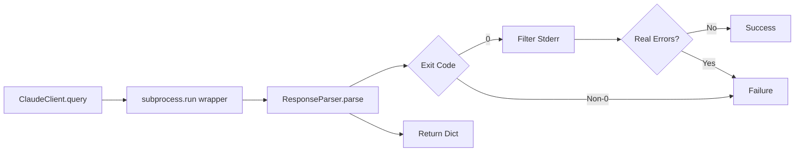

# Design Document

## Overview

This feature adds intelligent error detection to the Claude wrapper response parsing, distinguishing real errors from benign stderr warnings. The design introduces a `ResponseParser` class with configurable noise filtering, integrated into `ClaudeClient` to fix false failure detection.

## Steering Document Alignment

### Technical Standards (tech.md)
- Python 3.11+ with type hints
- pydantic for config validation
- structlog for structured logging
- pytest with >80% coverage

### Project Structure (structure.md)
- New module: `airflow_dags/autonomous_fixing/adapters/ai/response_parser.py`
- Config file: `config/error_patterns.yaml` (new)
- Integration: `airflow_dags/autonomous_fixing/adapters/ai/claude_client.py` (modify)
- Follows `snake_case` naming, `PascalCase` classes

## Code Reuse Analysis

### Existing Components to Leverage
- **ClaudeClient** (`adapters/ai/claude_client.py`): Modify `query()` method to use new parser
- **Error Patterns**: Extract from existing code (IssueFixer error handling)
- **DebugLogger**: Continue using existing logging infrastructure

### Integration Points
- **ClaudeClient.query()**: Replace simple success check with `ResponseParser.parse()`
- **IssueFixer Methods**: No changes needed (receive improved response format)
- **Config Loading**: Use existing YAML config pattern from project

## Architecture



## Components and Interfaces

### Component 1: ResponseParser

**File:** `airflow_dags/autonomous_fixing/adapters/ai/response_parser.py`

```python
class ResponseParser:
    # Noise patterns (non-errors)
    NOISE_PATTERNS = [
        "punycode module is deprecated",
        "ExperimentalWarning:",
        "Skipping files that match",
        "(node:",
        "DeprecationWarning"
    ]

    # Error indicators (real errors)
    ERROR_INDICATORS = [
        "Error:", "FAILED:", "Exception:", "Traceback",
        "SyntaxError", "command not found", "AssertionError"
    ]

    def __init__(self, config_path: Optional[Path] = None):
        """Load custom patterns from config if provided"""

    def parse(self, result: dict, operation: str = "unknown") -> dict:
        """
        Parse wrapper response, filter noise, detect real errors.

        Returns:
            {"success": bool, "error_message": str, "errors": list, "status": str}
        """

    def _extract_real_errors(self, stderr: str) -> list[str]:
        """Filter stderr, return only real error lines"""

    def _is_noise(self, line: str) -> bool:
        """Check if line matches noise patterns"""
```

**Dependencies:** `pathlib`, `yaml`, `typing`

### Component 2: Error Pattern Config

**File:** `config/error_patterns.yaml`

```yaml
# Noise patterns (not real errors)
noise_patterns:
  - pattern: "punycode"
    type: "substring"  # or "regex"
    reason: "Deprecated module warning"
  - pattern: "ExperimentalWarning"
    type: "substring"
    reason: "Node.js experimental features"

# Error indicators (real failures)
error_indicators:
  - pattern: "Error:"
    type: "substring"
  - pattern: "Traceback"
    type: "substring"
```

### Component 3: ClaudeClient Integration

**File:** `airflow_dags/autonomous_fixing/adapters/ai/claude_client.py`

**Modifications:**
```python
class ClaudeClient:
    def __init__(self, wrapper_path, python_exec, debug_logger=None):
        # ... existing code ...
        self.parser = ResponseParser()  # NEW

    def query(self, prompt, project_path, timeout, prompt_type="query"):
        # ... existing subprocess code ...

        # OLD:
        # return {"success": result.returncode == 0}

        # NEW:
        raw_result = {
            "run_status": "completed" if result.returncode == 0 else "failed",
            "stderr": result.stderr,
            "stdout": result.stdout,
            "exit_code": result.returncode
        }
        return self.parser.parse(raw_result, operation=prompt_type)
```

## Error Handling

1. **Invalid Config**: Log warning, use defaults
2. **Malformed Response**: Return `{"success": False, "error_message": "Malformed response"}`
3. **Unicode Errors**: Decode with `errors='replace'`
4. **ReDoS Risk**: Validate regex complexity before compiling

## Testing Strategy

### Unit Tests: `tests/unit/test_response_parser.py`
- Test noise filtering (warnings → success)
- Test error detection (errors → failure)
- Test config loading (custom patterns)
- Test edge cases (empty stderr, unicode, huge output)

### Integration Tests: `tests/integration/test_claude_client_parser.py`
- Test ClaudeClient with real wrapper responses
- Verify backward compatibility with old format

### E2E Tests: `tests/e2e/test_false_negatives_fixed.py`
- Run autonomous fixing on project with deprecation warnings
- Verify no false failures reported
