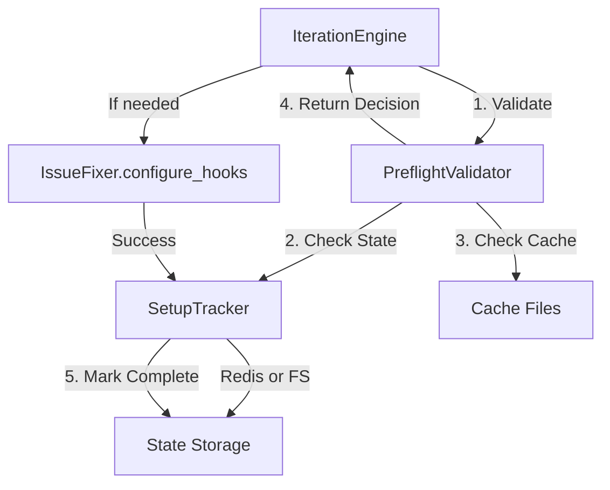

# Design Document

## Overview

This feature adds a computational validation layer that checks setup completion before invoking AI, integrated with persistent state tracking to prevent redundant setup operations across sessions. The design introduces a `PreflightValidator` class that performs fast filesystem and cache checks, a `SetupTracker` for persistent state management, and seamless integration into the existing `IterationEngine` workflow.

## Steering Document Alignment

### Technical Standards (tech.md)
- **Python 3.11+**: All code uses Python 3.11 features (type hints, pathlib)
- **pydantic**: State models use pydantic for validation
- **structlog**: All logging uses structured logging
- **Testing**: pytest with >80% coverage target
- **Code Quality**: Follows ruff, mypy, black standards

### Project Structure (structure.md)
- New module: `airflow_dags/autonomous_fixing/core/validators/preflight.py` (aligns with `core/` modules pattern)
- New module: `airflow_dags/autonomous_fixing/core/setup_tracker.py` (aligns with `core/` modules pattern)
- Integration point: `airflow_dags/autonomous_fixing/core/iteration_engine.py` (existing)
- Follows naming convention: `snake_case` modules, `PascalCase` classes
- Dependencies: `validators/` → `core/` (one-way dependency, no circular refs)

## Code Reuse Analysis

### Existing Components to Leverage
- **IssueFixer (core/fixer.py)**: Cache path logic (lines 346, 403) - extract to shared utility
- **IterationEngine (core/iteration_engine.py)**: Setup phase loop (lines 74-91) - integrate validation calls
- **State Manager Config**: Reuse existing Redis connection from `config['state_manager']`
- **Debug Logger**: Use existing `self.debug_logger` for skip decision logging
- **Path Utilities**: Leverage existing `Path` operations from fixer.py

### Integration Points
- **IterationEngine.run_improvement_loop()**: Add validator instantiation and skip logic before lines 82, 91
- **IssueFixer**: No changes needed (validation wraps existing methods)
- **Redis State Manager**: Optional integration via `config['state_manager']` settings
- **File-based Cache**: Leverage existing `config/precommit-cache/` and `config/test-cache/` directories

## Architecture

### Modular Design Principles
- **Single File Responsibility**:
  - `preflight.py` = Pre-execution validation only
  - `setup_tracker.py` = State persistence only
  - Integration logic lives in `iteration_engine.py` (orchestration)
- **Component Isolation**: Validator has zero dependencies on AI/wrapper components
- **Service Layer Separation**: Validation (pre-flight) → Execution (fixer) → State (tracker) clean separation
- **Utility Modularity**: Cache validation extracted to reusable methods



## Components and Interfaces

### Component 1: PreflightValidator

**Purpose:** Perform fast computational checks to determine if setup phases can be skipped

**Interfaces:**
```python
class PreflightValidator:
    def __init__(self, setup_tracker: SetupTracker):
        """Initialize with state tracker for completion checks"""

    def can_skip_hook_config(self, project_path: Path) -> tuple[bool, str]:
        """
        Check if pre-commit hooks setup can be skipped.

        Returns:
            (can_skip, reason) where reason explains decision
        """

    def can_skip_test_discovery(self, project_path: Path) -> tuple[bool, str]:
        """
        Check if test discovery can be skipped.

        Returns:
            (can_skip, reason) where reason explains decision
        """

    def _validate_hook_cache(self, cache_path: Path) -> tuple[bool, dict]:
        """Validate hook configuration cache integrity"""

    def _validate_test_cache(self, cache_path: Path) -> tuple[bool, dict]:
        """Validate test discovery cache integrity"""
```

**Dependencies:**
- `pathlib.Path` for file operations
- `time` for timestamp checks
- `yaml` for cache parsing
- `SetupTracker` for state queries

**Reuses:**
- Cache path construction pattern from `IssueFixer` (lines 346, 403)
- YAML loading pattern from existing codebase

### Component 2: SetupTracker

**Purpose:** Track setup phase completion persistently across sessions using Redis (primary) or filesystem (fallback)

**Interfaces:**
```python
class SetupTracker:
    def __init__(self, redis_config: Optional[dict] = None):
        """Initialize with optional Redis connection"""

    def mark_setup_complete(self, project: str, phase: str) -> None:
        """Mark setup phase as successfully completed"""

    def is_setup_complete(self, project: str, phase: str) -> bool:
        """Check if setup phase was completed recently (<30 days)"""

    def _get_state_key(self, project: str, phase: str) -> str:
        """Generate Redis key or filesystem path for state"""

    def _redis_store(self, key: str, ttl: int) -> bool:
        """Store state in Redis (returns False if unavailable)"""

    def _filesystem_store(self, project: str, phase: str) -> None:
        """Fallback: store state as filesystem marker"""
```

**Dependencies:**
- `redis` (optional) for distributed state
- `pathlib.Path` for filesystem fallback
- `datetime` for timestamp operations
- `hashlib` for project path hashing

**Reuses:**
- Redis connection pattern from `config['state_manager']` (existing warps.yaml:42-44)
- Filesystem marker pattern similar to existing cache files

### Component 3: IterationEngine Integration

**Purpose:** Integrate validation seamlessly into existing setup loop

**Interfaces:** (Modifications to existing `IterationEngine.run_improvement_loop`)
```python
# NEW: Lines 74-75 (after time_gate initialization)
setup_tracker = SetupTracker(self.config.get('state_manager'))
validator = PreflightValidator(setup_tracker)

# MODIFIED: Lines 80-83 (hook configuration loop)
for lang_name, project_list in projects_by_language.items():
    for project_path in project_list:
        can_skip, reason = validator.can_skip_hook_config(Path(project_path))
        if can_skip:
            print(f"   ⏭️  {Path(project_path).name}: {reason}")
            continue

        # Existing call
        success = self.fixer.configure_precommit_hooks(project_path, lang_name)
        if success:
            setup_tracker.mark_setup_complete(project_path, 'hooks')

# MODIFIED: Lines 89-92 (test discovery loop)
for lang_name, project_list in projects_by_language.items():
    for project_path in project_list:
        can_skip, reason = validator.can_skip_test_discovery(Path(project_path))
        if can_skip:
            print(f"   ⏭️  {Path(project_path).name}: {reason}")
            continue

        # Existing call
        result = self.fixer.discover_test_config(project_path, lang_name)
        if result.success:
            setup_tracker.mark_setup_complete(project_path, 'tests')
```

**Dependencies:**
- `PreflightValidator` (new)
- `SetupTracker` (new)
- Existing `IssueFixer` methods (unchanged)

**Reuses:**
- Existing loop structure from `iteration_engine.py:80-92`
- Existing fixer methods (no modifications needed)

## Data Models

### StateMarker (Filesystem Fallback)
```python
# File: .ai-state/{phase}_complete.marker
# Format: Plain text with ISO timestamp
# Example content:
2025-10-04T12:37:05.123456
```

### RedisStateKey
```python
# Key format: setup:{project_hash}:{phase}
# Value: "complete"
# TTL: 2592000 seconds (30 days)
# Example: setup:a3f2e1b9:hooks → "complete" (expires 2025-11-03)
```

### CacheValidationResult
```python
from pydantic import BaseModel

class CacheValidationResult(BaseModel):
    valid: bool
    data: dict
    reason: str  # Explanation if invalid

# Example:
CacheValidationResult(
    valid=True,
    data={'hook_framework': {'installed': True}},
    reason="Cache valid and complete"
)
```

## Error Handling

### Error Scenarios

1. **Scenario: Corrupted cache file (invalid YAML)**
   - **Handling:** Catch `yaml.YAMLError`, log warning, return `(False, "Cache corrupted: {error}")`
   - **User Impact:** System proceeds with AI invocation, no disruption

2. **Scenario: Missing cache file permissions**
   - **Handling:** Catch `PermissionError`, log warning, return `(False, "Cache unreadable")`
   - **User Impact:** System proceeds with AI invocation as if no cache exists

3. **Scenario: Redis connection timeout**
   - **Handling:** 100ms timeout, catch exception, fallback to filesystem markers silently
   - **User Impact:** Transparent fallback, no user-visible error

4. **Scenario: Incomplete cache (missing required fields)**
   - **Handling:** Validate required fields, return `(False, "Cache incomplete: missing {fields}")`
   - **User Impact:** System treats as cache miss, re-runs AI discovery

5. **Scenario: Concurrent marker file access**
   - **Handling:** Use atomic file operations (`Path.write_text` is atomic), no locks needed
   - **User Impact:** No impact, last-write-wins is acceptable for markers

6. **Scenario: State marker older than 30 days**
   - **Handling:** Check timestamp, treat as stale, return `(False, "State stale (45d old)")`
   - **User Impact:** System re-validates setup, ensures freshness

## Testing Strategy

### Unit Testing

**Test File:** `tests/unit/test_preflight_validator.py`
- Test `can_skip_hook_config()` with valid cache, missing cache, corrupted cache, stale state
- Test `can_skip_test_discovery()` with valid cache, incomplete cache
- Test `_validate_hook_cache()` with all error conditions
- Test timestamp age calculations (mock `time.time()`)
- Mock filesystem operations for deterministic tests

**Test File:** `tests/unit/test_setup_tracker.py`
- Test `mark_setup_complete()` with Redis available/unavailable
- Test `is_setup_complete()` with Redis hits, Redis misses, filesystem fallback
- Test filesystem marker creation and reading
- Test TTL expiration logic
- Mock Redis client for isolation

**Coverage Target:** >90% for both modules (critical path code)

### Integration Testing

**Test File:** `tests/integration/test_setup_optimization_flow.py`
- Test full flow: first run (no cache) → AI invocation → cache creation → second run (skip)
- Test Redis integration with real Redis container (docker-compose)
- Test filesystem fallback when Redis unavailable
- Test concurrent access from multiple orchestrator runs
- Verify skip decisions logged correctly with savings

**Key Flows:**
1. Clean project → validation fails → AI runs → cache created → validation succeeds
2. Existing cache → validation succeeds → AI skipped → logs show savings
3. Corrupted cache → validation fails → AI runs → cache overwritten

### End-to-End Testing

**Test File:** `tests/e2e/test_autonomous_fixing_with_cache.py`
- Run full `autonomous_fix.sh` twice on same project
- Verify first run executes setup, second run skips setup
- Measure time savings (should be 100s+ faster on second run)
- Verify final results identical (caching doesn't affect quality)
- Test with config/projects/warps.yaml (real project)

**User Scenarios:**
1. First-time setup: User runs autonomous fixing on fresh project
2. Repeated runs: User runs fixing multiple times (improvements, iterations)
3. Stale cache: User returns to project after 31+ days, setup re-runs
4. Manual cache clear: User deletes cache, setup re-runs as expected
