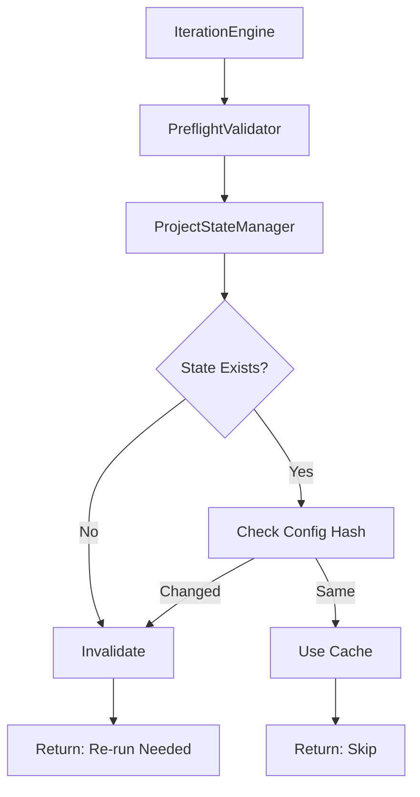

# Design Document

## Overview

This feature adds project-based state management with smart invalidation, storing setup state in `.ai-state/` directory within each project. The design introduces a `ProjectStateManager` class that handles state persistence, validation, and cache invalidation based on configuration file changes.

## Steering Document Alignment

### Technical Standards (tech.md)
- Python 3.11+ with type hints, pydantic, structlog, pytest >80%

### Project Structure (structure.md)
- New module: `airflow_dags/autonomous_fixing/core/state_manager.py`
- State location: `{project}/.ai-state/` (per-project)
- Integration: `core/validators/preflight.py`, `core/iteration_engine.py`

## Code Reuse Analysis

### Existing Components
- **IssueFixer**: Cache path logic (extract to state_manager)
- **PreflightValidator**: Validation logic (delegate to state_manager)
- **Path Utilities**: Reuse pathlib patterns

### Integration Points
- **PreflightValidator**: Use `ProjectStateManager.should_reconfigure()`
- **IterationEngine**: Use `ProjectStateManager.save_state()` after successful setup

## Architecture



## Components and Interfaces

### Component 1: ProjectStateManager

**File:** `airflow_dags/autonomous_fixing/core/state_manager.py`

```python
class ProjectStateManager:
    def __init__(self, project_path: Path):
        self.project = project_path
        self.state_dir = project_path / ".ai-state"

    def save_state(self, phase: str, data: dict):
        """Save state with metadata and validation markers"""

    def should_reconfigure(self, phase: str) -> tuple[bool, str]:
        """Check if reconfiguration needed (state missing/stale/invalidated)"""

    def _get_config_hash(self, phase: str) -> str:
        """Compute SHA256 hash of relevant config files"""

    def _ensure_gitignore(self):
        """Add .ai-state/ to .gitignore if not present"""
```

**State File Format:**
```markdown
# {Phase} Configuration State
Generated: 2025-10-04T12:37:05.123456
Status: CONFIGURED

## Configuration Hash
config_hash: a3f2e1b9c4d5e6f7

## Validation Markers
- Hook file exists: True
- Config file exists: True
- Last verified: 2025-10-04T12:37:05

## Cache Invalidation Triggers
- .pre-commit-config.yaml modified
- .git/hooks/pre-commit deleted
- State age > 30 days
```

### Component 2: Smart Invalidation Logic

**Invalidation Triggers:**
1. **Config Modified**: `.pre-commit-config.yaml` or `package.json` mtime > state mtime
2. **Config Hash Changed**: SHA256 of config files ≠ stored hash
3. **Files Deleted**: Required files (hooks, config) no longer exist
4. **State Stale**: State age > 30 days

### Component 3: Migration Support

**Fallback Order:**
1. Check `.ai-state/{phase}_state.md` (new location)
2. Check `config/{phase}-cache/{project}-{phase}.yaml` (old location)
3. If old location newer → use it, log migration notice
4. Always write to new location only

## Error Handling

1. **Corrupted State File**: Log error, delete file, return "needs reconfiguration"
2. **Missing Config File**: Compute hash from existing files only
3. **Permission Errors**: Log warning, fallback to external cache
4. **Concurrent Writes**: Use atomic file operations (write temp, rename)

## Testing Strategy

### Unit Tests: `tests/unit/test_project_state_manager.py`
- Test state save/load cycle
- Test hash computation and comparison
- Test invalidation triggers (modified files, deleted files, stale state)
- Test gitignore creation and updates
- Test backward compatibility with external cache

### Integration Tests: `tests/integration/test_state_migration.py`
- Test migration from external to project-based state
- Test cross-machine consistency (copy project, verify state works)
- Test concurrent access (multiple orchestrators on same project)

### E2E Tests: `tests/e2e/test_project_state_portability.py`
- Run autonomous fixing, verify state created in `.ai-state/`
- Copy project to different path, verify state still works
- Modify config file, verify state invalidated and setup re-runs
