# Autonomous Fixing - System Design Diagrams

Comprehensive system design diagrams for the autonomous code fixing system using Mermaid.

## Table of Contents

- [High-Level Architecture](#high-level-architecture)
- [Priority-Based Execution Flow](#priority-based-execution-flow)
- [Multi-Language Orchestration](#multi-language-orchestration)
- [Health Monitoring System](#health-monitoring-system)
- [Issue Discovery & Batching](#issue-discovery--batching)
- [State Management](#state-management)
- [Execution Modes](#execution-modes)
- [Integration Points](#integration-points)

## High-Level Architecture

### System Overview

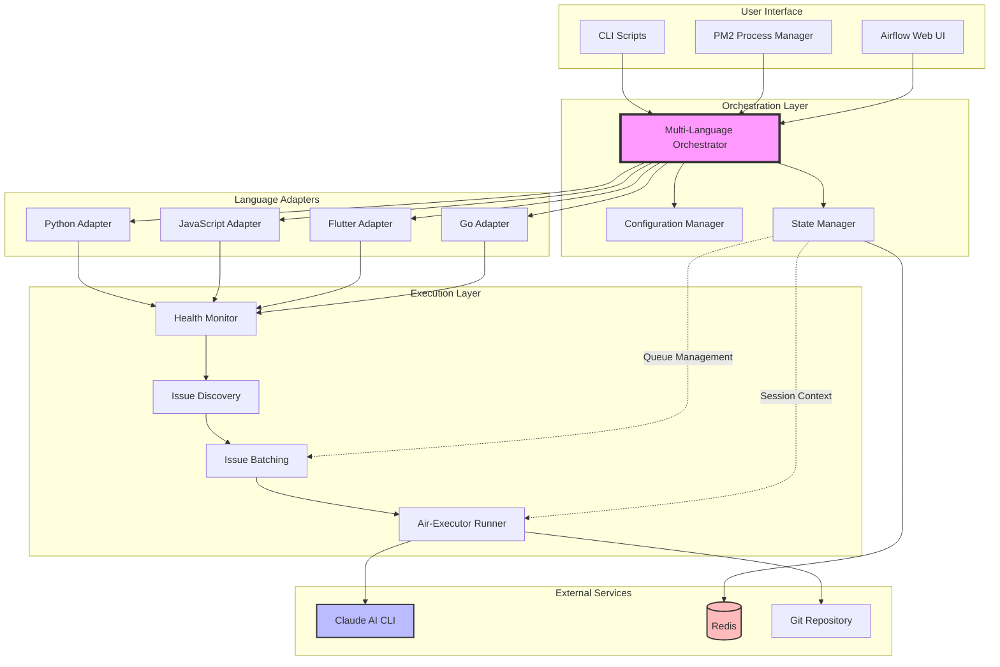

### Component Relationships

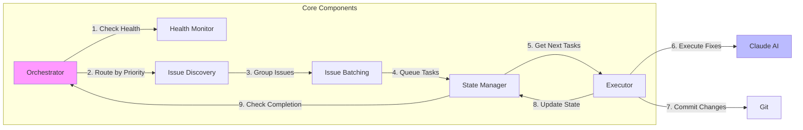

## Priority-Based Execution Flow

### Complete Execution Lifecycle

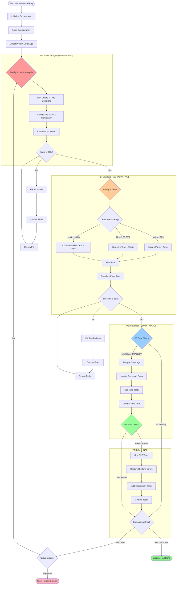

### Adaptive Test Strategy Selection

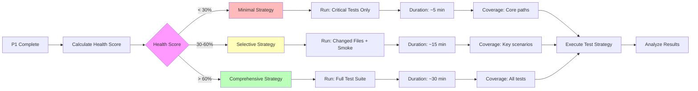

## Multi-Language Orchestration

### Language Detection & Routing

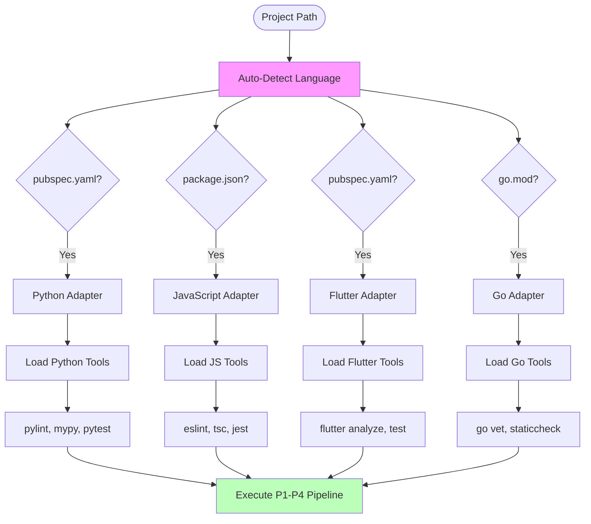

### Parallel Multi-Project Execution

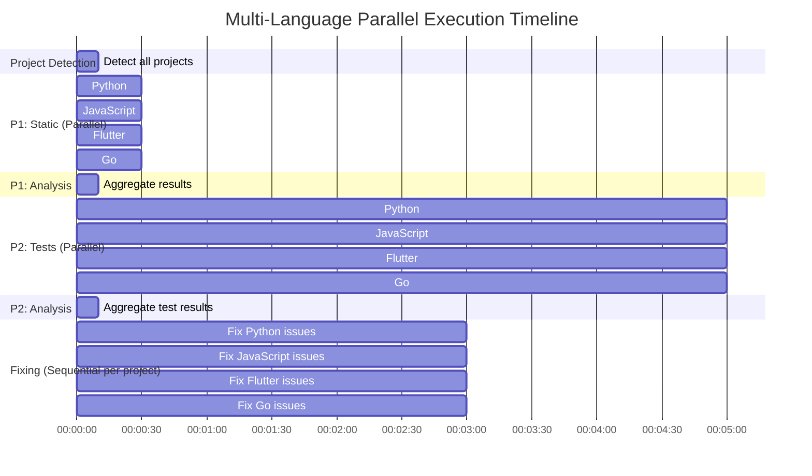

## Health Monitoring System

### Health Score Calculation

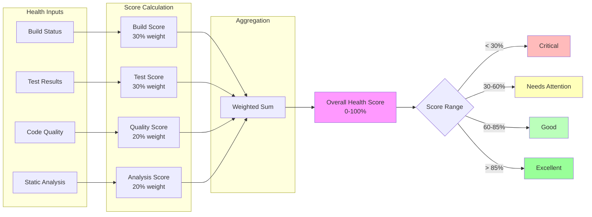

### Metrics Collection Pipeline

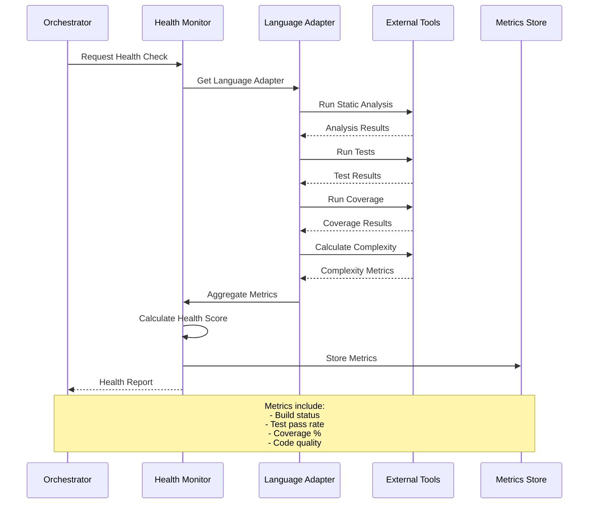

## Issue Discovery & Batching

### Issue Discovery Flow

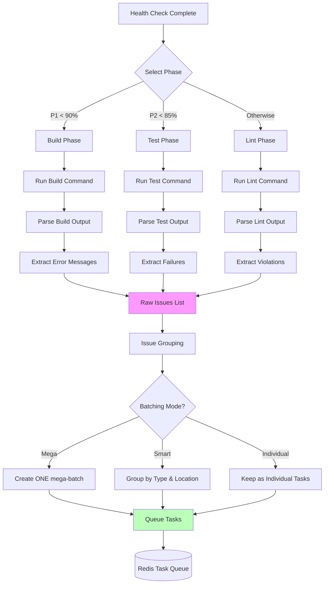

### Smart Batching Logic

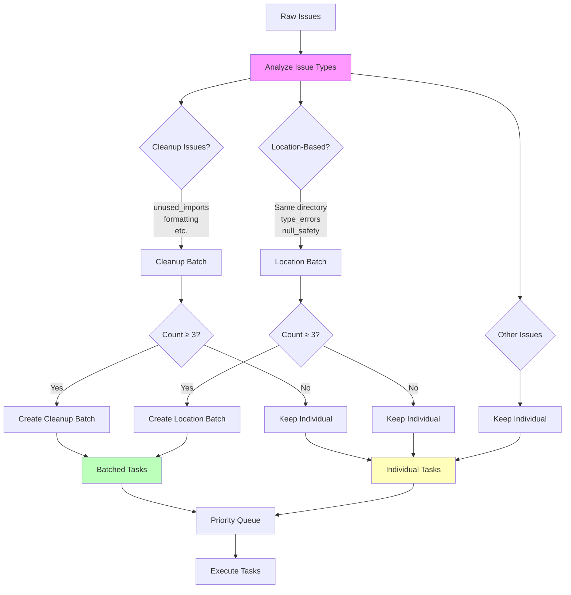

### Batching Mode Comparison

```mermaid
graph TB
    subgraph "Mega Batch Mode"
        M1[100 Issues] --> M2[1 Mega-Batch]
        M2 --> M3[1 Claude Session]
        M3 --> M4[1 Commit]
        M4 --> M5[~15 min]
    end

    subgraph "Smart Batch Mode"
        S1[100 Issues] --> S2[5-7 Batches]
        S2 --> S3[5-7 Claude Sessions]
        S3 --> S4[5-7 Commits]
        S4 --> S5[~60 min]
    end

    subgraph "Individual Mode"
        I1[100 Issues] --> I2[100 Tasks]
        I2 --> I3[100 Claude Sessions]
        I3 --> I4[100 Commits]
        I4 --> I5[~150 min]
    end

    style M2 fill:#fbb
    style S2 fill:#ffb
    style I2 fill:#bfb
```

## State Management

### Redis State Schema

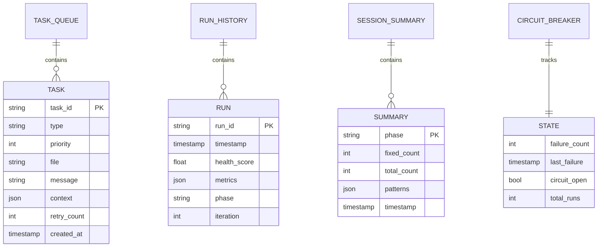

### State Flow

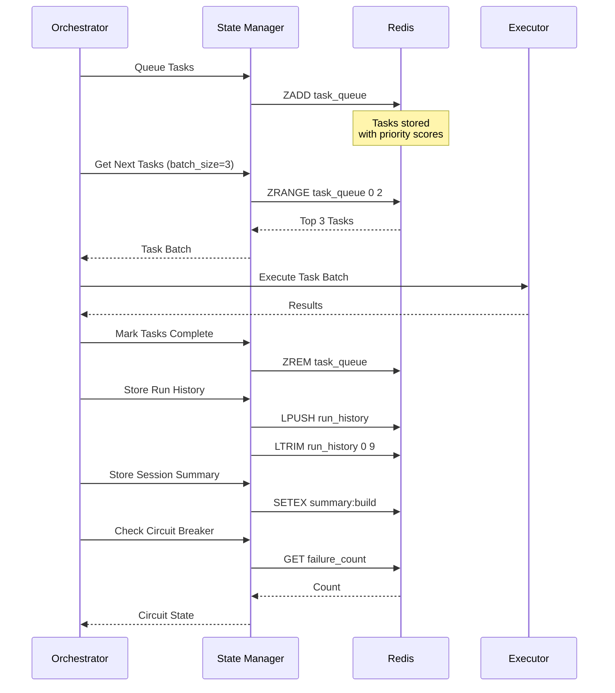

## Execution Modes

### PM2 vs Airflow Execution

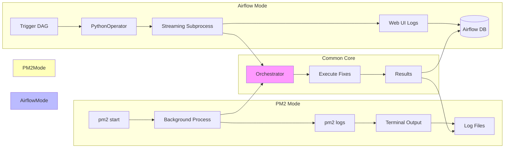

### Simulation vs Live Mode

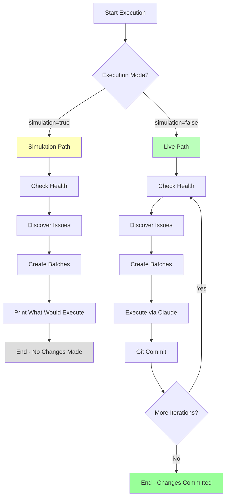

## Integration Points

### Claude AI Integration

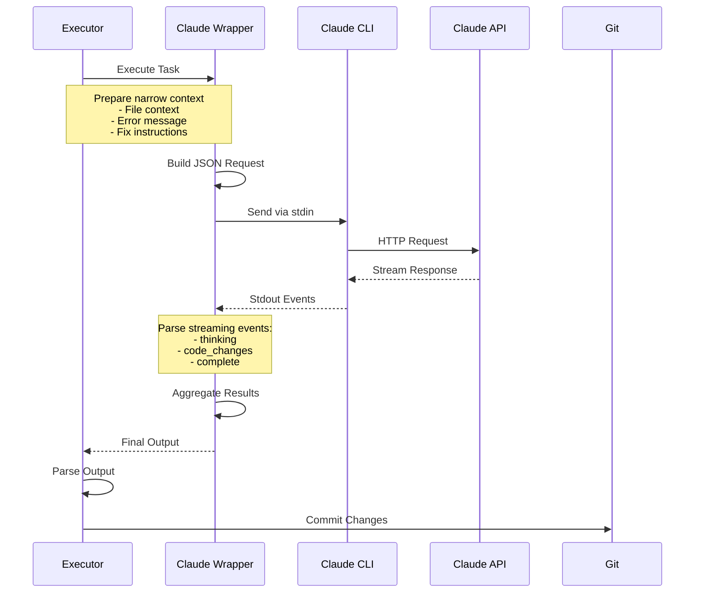

### Git Integration Flow

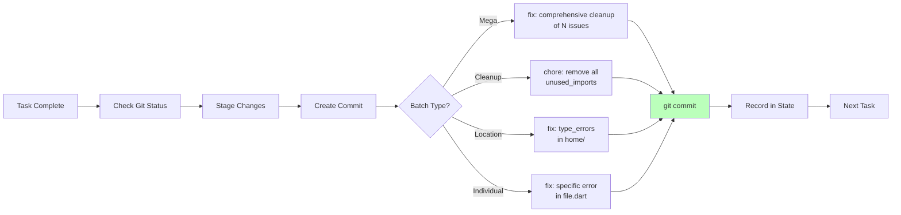

### Complete Integration Architecture

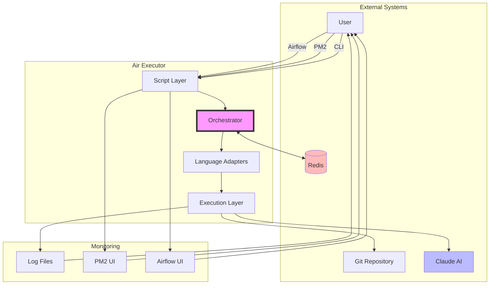

## Data Flow Diagrams

### End-to-End Data Flow

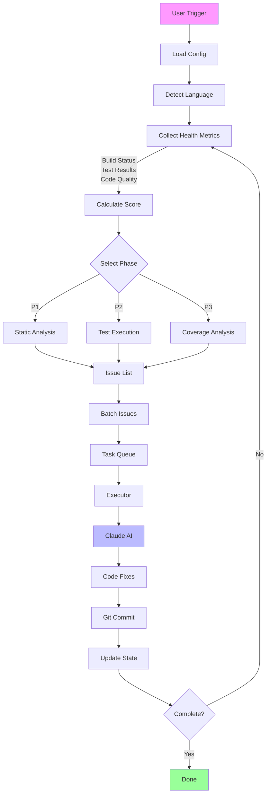

---

## Usage Examples

### Viewing Diagrams

These Mermaid diagrams render automatically on:
- **GitHub**: View this file on GitHub
- **VS Code**: Install "Markdown Preview Mermaid Support" extension
- **Online**: Copy to https://mermaid.live

### Diagram Categories

1. **Architecture Diagrams**: System overview, component relationships
2. **Flow Diagrams**: Execution flows, decision trees
3. **Sequence Diagrams**: Component interactions, message flow
4. **State Diagrams**: State management, data schemas
5. **Integration Diagrams**: External system integration

### Creating New Diagrams

Follow this template:

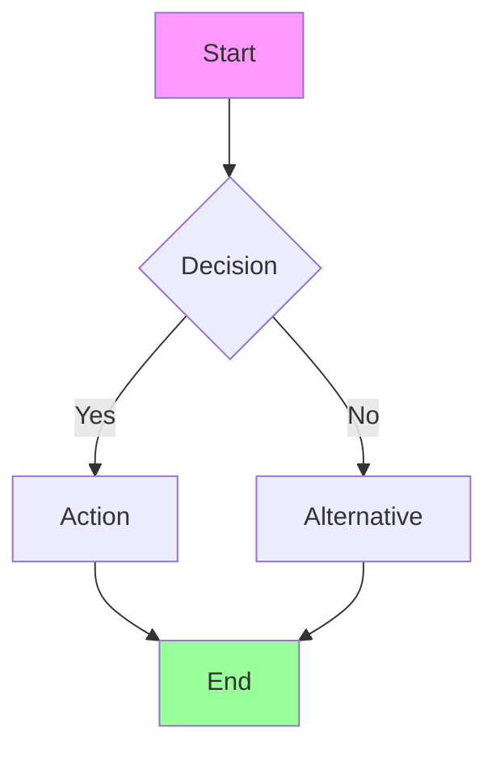

## See Also

- **Main Docs**: `/docs/AUTONOMOUS_FIXING.md` - Complete guide
- **Implementation**: `/airflow_dags/autonomous_fixing/` - Source code
- **Configuration**: `/docs/CONFIGURATION.md` - Config reference

---

**Last Updated**: 2025-01-10
**Diagram Format**: Mermaid (GitHub compatible)
