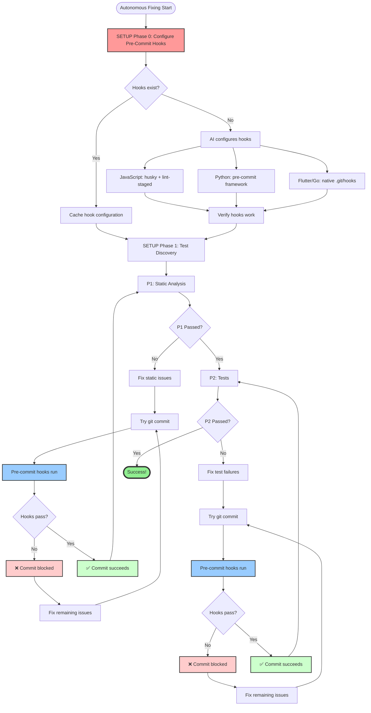
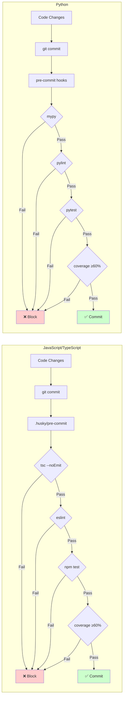
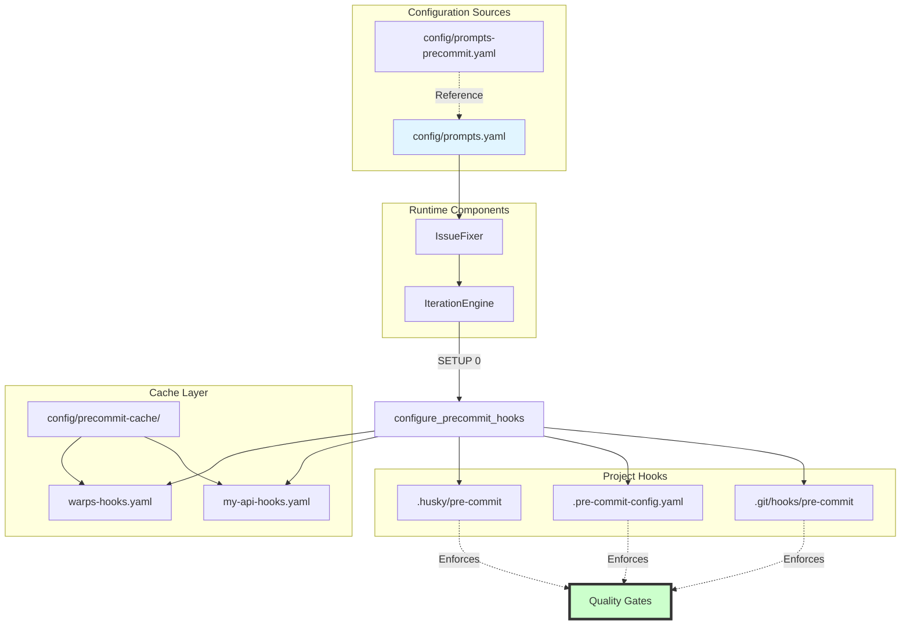

# Pre-Commit Hook Integration Architecture

## Execution Flow



## Pre-Commit Hook Quality Gates



## Comparison: Old vs New Approach

```mermaid
graph TB
    subgraph "OLD: Prompt-Based (Fragile)"
        O1[AI receives prompt] --> O2["Prompt: Please run eslint"]
        O2 --> O3{AI decides}
        O3 -->|Follows| O4[Runs eslint]
        O3 -->|Ignores| O5[Skips check]
        O4 --> O6[Sees errors]
        O6 --> O7{AI decides}
        O7 -->|Good| O8[Fixes code]
        O7 -->|Bad| O9[Uses --no-verify]
        O8 --> O10[git commit]
        O9 --> O10
        O5 --> O10
    end

    subgraph "NEW: Hook-Based (Robust)"
        N1[AI receives prompt] --> N2["Prompt: Fix code to pass hooks"]
        N2 --> N3[Fixes code]
        N3 --> N4[git commit]
        N4 --> N5[Hooks run automatically]
        N5 --> N6{All checks pass?}
        N6 -->|No| N7[❌ Commit blocked]
        N6 -->|Yes| N8[✅ Commit succeeds]
        N7 --> N9[Must fix issues]
        N9 --> N3
    end

    style O5 fill:#ffcccc,stroke:#333,stroke-width:2px
    style O9 fill:#ffcccc,stroke:#333,stroke-width:2px
    style N7 fill:#ffffcc,stroke:#333,stroke-width:2px
    style N8 fill:#ccffcc,stroke:#333,stroke-width:2px
```



## Configuration Architecture



## Integration with Existing System

### Before (Prompt-Only)

```
SETUP → P1 (AI runs linters manually) → P2 (AI runs tests manually) → Success
```

### After (Hook-Enforced)

```
SETUP 0: Configure Hooks
    ↓
SETUP 1: Test Discovery
    ↓
P1 (Hooks enforce linting)
    ↓
P2 (Hooks enforce tests + coverage)
    ↓
Success
```

## Benefits Summary

| Aspect | Old (Prompts) | New (Hooks) |
|--------|--------------|-------------|
| **Reliability** | AI might skip checks | Git enforces checks |
| **Bypass** | `--no-verify` possible | Forbidden by prompts |
| **Consistency** | Varies per execution | Same every time |
| **Speed** | AI decides when to check | Automatic on commit |
| **Learning** | AI interprets prompts | AI reads hook config |
| **Trust** | Relies on AI behavior | Relies on git |

## Key Design Decisions

### 1. SETUP Phase 0 (Before everything)
- **Why:** Hooks must exist before P1/P2 phases need them
- **When:** First time project is processed
- **Cache:** 7-day TTL (hooks don't change often)

### 2. Prompt Updates (Respect hooks)
- **Why:** AI must know hooks exist and respect them
- **How:** Check for hooks, never use `--no-verify`
- **Enforcement:** Prompts explicitly forbid bypassing

### 3. Cache Strategy
- **Location:** `config/precommit-cache/`
- **Format:** YAML (human-readable)
- **Content:** Hook config, tools used, verification status
- **TTL:** 7 days (can be reconfigured)

### 4. Fallback Behavior
- **If hook config fails:** Continue without hooks (log warning)
- **If hooks don't exist:** AI tries to configure them
- **If can't configure:** Fall back to manual checks (old way)

## See Also

- [Main Architecture Diagrams](./autonomous-fixing-diagrams.md)
- [Pre-Commit Hooks Strategy](../PRE_COMMIT_HOOKS.md)
- [Prompt Configuration](../../config/prompts.yaml)
