# Progressive Pre-Commit Hook Enforcement Strategy

## Problem Statement

**Naive Approach (Dangerous):**
```bash
# Day 1: Project with 500 type errors, 0 tests
./autonomous_fix.sh

# SETUP: Install all hooks at once
- ✅ Type checking (tsc)
- ✅ Linting (eslint)
- ✅ Tests (npm test)
- ✅ Coverage ≥60%

# Result: EVERY commit blocked! System stuck!
# Can't make progress because hooks block all commits
```

**Problem:** Hooks enforce quality the codebase hasn't achieved yet.

## Solution: Progressive Enforcement

**Key Insight:** Only enforce what has been **proven to pass**.

```
Phase P1 Complete (type errors = 0)
  → Enable type checking hook

Phase P2 Complete (tests passing)
  → Enable test running hook

Phase P3 Complete (coverage ≥60%)
  → Enable coverage hook
```

## Architecture

### Hook Configuration Levels

```mermaid
graph TB
    Start([Project Start: No hooks]) --> P0[SETUP: Install hook framework]

    P0 --> P1Work[P1: Fix Type/Build Errors]
    P1Work --> P1Gate{P1 Gate Passed?}

    P1Gate -->|No| P1Work
    P1Gate -->|Yes| EnableL1[Enable Level 1 Hooks]

    EnableL1 --> L1Active[🔒 Type checking locked in]
    L1Active --> P2Work[P2: Fix Tests]

    P2Work --> P2Gate{P2 Gate Passed?}
    P2Gate -->|No| P2Work
    P2Gate -->|Yes| EnableL2[Enable Level 2 Hooks]

    EnableL2 --> L2Active[🔒 Type + Tests locked in]
    L2Active --> P3Work[P3: Improve Coverage]

    P3Work --> P3Gate{P3 Gate Passed?}
    P3Gate -->|No| P3Work
    P3Gate -->|Yes| EnableL3[Enable Level 3 Hooks]

    EnableL3 --> L3Active[🔒 Full Quality Locked In]
    L3Active --> Complete([All Quality Gates Enforced])

    style Start fill:#ffcccc
    style EnableL1 fill:#ffffcc,stroke:#333,stroke-width:2px
    style EnableL2 fill:#ffffcc,stroke:#333,stroke-width:2px
    style EnableL3 fill:#ffffcc,stroke:#333,stroke-width:2px
    style L1Active fill:#ccffcc
    style L2Active fill:#99ff99
    style L3Active fill:#66ff66
    style Complete fill:#00ff00,stroke:#333,stroke-width:4px
```



### Hook Levels Definition

#### Level 0: Framework Only (SETUP)
```yaml
status: "Framework installed, no enforcement"
hooks_enabled: []
purpose: "Install husky/pre-commit infrastructure"

# .husky/pre-commit
#!/bin/sh
echo "⏭️  Pre-commit hooks: LEARNING MODE (no enforcement yet)"
exit 0  # Always pass
```

#### Level 1: Type Safety (After P1 Passes)
```yaml
status: "P1 gate passed - type safety enforced"
hooks_enabled:
  - type_checking
  - build_validation

# .husky/pre-commit
#!/bin/sh
echo "🔍 Level 1 Checks: Type Safety"

# Type checking MUST pass
npm run type-check || {
  echo "❌ Type checking failed - P1 quality gate would be violated"
  exit 1
}

# Build MUST succeed
npm run build || {
  echo "❌ Build failed - P1 quality gate would be violated"
  exit 1
}

echo "✅ Level 1 checks passed"
exit 0
```

#### Level 2: Type + Tests (After P2 Passes)
```yaml
status: "P2 gate passed - type + tests enforced"
hooks_enabled:
  - type_checking
  - build_validation
  - unit_tests

# .husky/pre-commit
#!/bin/sh
echo "🔍 Level 2 Checks: Type Safety + Tests"

# Level 1: Type checking
npm run type-check || exit 1

# Level 1: Build
npm run build || exit 1

# Level 2: Unit tests MUST pass
npm test -- --passWithNoTests || {
  echo "❌ Tests failed - P2 quality gate would be violated"
  exit 1
}

echo "✅ Level 2 checks passed"
exit 0
```

#### Level 3: Full Quality (After P3 Passes)
```yaml
status: "P3 gate passed - full quality enforced"
hooks_enabled:
  - type_checking
  - build_validation
  - unit_tests
  - coverage_threshold
  - linting

# .husky/pre-commit
#!/bin/sh
echo "🔍 Level 3 Checks: Full Quality Enforcement"

# Level 1: Type checking
npm run type-check || exit 1

# Level 1: Build
npm run build || exit 1

# Level 2: Tests
npm test -- --passWithNoTests || exit 1

# Level 3: Coverage threshold
npm test -- --coverage --coverageThreshold='{
  "global": {
    "branches": 60,
    "functions": 60,
    "lines": 60,
    "statements": 60
  }
}' || {
  echo "❌ Coverage below 60% - P3 quality gate would be violated"
  exit 1
}

# Level 3: Linting
npx eslint . || {
  echo "❌ Linting failed"
  exit 1
}

echo "✅ Level 3 checks passed - Full quality enforced!"
exit 0
```

## Implementation Strategy

### Phase Transition Logic

```python
class HookLevelManager:
    """Manages progressive hook enforcement."""

    LEVELS = {
        0: {
            'name': 'framework_only',
            'checks': [],
            'description': 'Hook framework installed, no enforcement'
        },
        1: {
            'name': 'type_safety',
            'checks': ['type_check', 'build'],
            'description': 'Type checking and build validation enforced',
            'requires': 'P1 gate passed'
        },
        2: {
            'name': 'tests',
            'checks': ['type_check', 'build', 'unit_tests'],
            'description': 'Type safety + unit tests enforced',
            'requires': 'P2 gate passed'
        },
        3: {
            'name': 'full_quality',
            'checks': ['type_check', 'build', 'unit_tests', 'coverage', 'lint'],
            'description': 'Full quality gates enforced',
            'requires': 'P3 gate passed'
        }
    }

    def upgrade_hooks_if_gate_passed(self, project_path: str, phase: str,
                                     gate_passed: bool, score: float):
        """
        Upgrade hook level when phase gate passes.

        Args:
            project_path: Project directory
            phase: 'p1', 'p2', or 'p3'
            gate_passed: Whether gate passed
            score: Current phase score
        """
        if not gate_passed:
            return

        current_level = self._get_current_level(project_path)

        # Determine target level based on phase
        target_level = {
            'p1': 1,  # Enable type checking
            'p2': 2,  # Enable tests
            'p3': 3   # Enable coverage + lint
        }.get(phase)

        if target_level > current_level:
            print(f"\n🔒 {phase.upper()} gate passed! Upgrading hooks to Level {target_level}")
            self._upgrade_to_level(project_path, target_level)
            self._verify_hooks_work(project_path)
```

### Hook File Templates

#### JavaScript/TypeScript Template
```javascript
// templates/husky-progressive.js
const levels = {
  0: () => {
    console.log('⏭️  Pre-commit hooks: LEARNING MODE');
    process.exit(0);
  },

  1: async () => {
    console.log('🔍 Level 1: Type Safety');
    await exec('npm run type-check');
    await exec('npm run build');
  },

  2: async () => {
    console.log('🔍 Level 2: Type Safety + Tests');
    await exec('npm run type-check');
    await exec('npm run build');
    await exec('npm test -- --passWithNoTests');
  },

  3: async () => {
    console.log('🔍 Level 3: Full Quality');
    await exec('npm run type-check');
    await exec('npm run build');
    await exec('npm test -- --passWithNoTests');
    await exec('npm test -- --coverage --coverageThreshold=\'{"global":{"branches":60,"functions":60,"lines":60,"statements":60}}\'');
    await exec('npx eslint .');
  }
};

// Read current level from config
const level = parseInt(fs.readFileSync('.husky/.level', 'utf8') || '0');
levels[level]().catch(() => process.exit(1));
```

#### Python Template
```yaml
# templates/pre-commit-progressive.yaml
# Level determined by .pre-commit-level file

repos:
  - repo: local
    hooks:
      # Level 1: Type checking (enabled after P1)
      - id: mypy
        name: mypy type checking
        entry: bash -c 'if [ "$(cat .pre-commit-level)" -ge 1 ]; then mypy .; else exit 0; fi'
        language: system
        types: [python]
        pass_filenames: false

      # Level 2: Tests (enabled after P2)
      - id: pytest
        name: pytest unit tests
        entry: bash -c 'if [ "$(cat .pre-commit-level)" -ge 2 ]; then pytest tests/; else exit 0; fi'
        language: system
        pass_filenames: false

      # Level 3: Coverage (enabled after P3)
      - id: pytest-cov
        name: pytest coverage
        entry: bash -c 'if [ "$(cat .pre-commit-level)" -ge 3 ]; then pytest --cov=src --cov-fail-under=60; else exit 0; fi'
        language: system
        pass_filenames: false

      # Level 3: Linting (enabled after P3)
      - id: pylint
        name: pylint
        entry: bash -c 'if [ "$(cat .pre-commit-level)" -ge 3 ]; then pylint src/; else exit 0; fi'
        language: system
        types: [python]
```

## Configuration Storage

### Hook Level Metadata
```yaml
# config/precommit-cache/warps-hooks.yaml
project_name: warps
language: javascript
current_level: 2

levels:
  0:
    enabled_at: 2025-10-04T08:00:00
    status: framework_installed

  1:
    enabled_at: 2025-10-04T09:15:00
    status: active
    trigger: P1 gate passed (score: 0.95)
    checks: [type_check, build]

  2:
    enabled_at: 2025-10-04T10:30:00
    status: active
    trigger: P2 gate passed (score: 0.88)
    checks: [type_check, build, unit_tests]

  3:
    enabled_at: null
    status: pending
    trigger: P3 gate not passed yet
    checks: [type_check, build, unit_tests, coverage, lint]

progression_history:
  - level: 0
    timestamp: 2025-10-04T08:00:00
    reason: Initial setup

  - level: 1
    timestamp: 2025-10-04T09:15:00
    reason: P1 gate passed (0.95 score)
    iteration: 3

  - level: 2
    timestamp: 2025-10-04T10:30:00
    reason: P2 gate passed (0.88 score)
    iteration: 5
```

## Safety Mechanisms

### 1. Gate Verification Before Upgrade
```python
def verify_gate_before_upgrade(self, project_path: str, target_level: int):
    """
    Verify quality gate is actually passing before enabling hooks.
    Prevents false upgrades.
    """
    adapter = self._get_adapter(project_path)

    if target_level >= 1:
        # Verify type checking passes
        result = adapter.run_type_check(project_path)
        if not result.success:
            print("❌ Cannot upgrade to Level 1: Type checking still failing")
            return False

    if target_level >= 2:
        # Verify tests pass
        result = adapter.run_tests(project_path, strategy='minimal')
        if not result.success or result.tests_failed > 0:
            print("❌ Cannot upgrade to Level 2: Tests still failing")
            return False

    if target_level >= 3:
        # Verify coverage meets threshold
        result = adapter.analyze_coverage(project_path)
        if result.coverage_percentage < 60:
            print(f"❌ Cannot upgrade to Level 3: Coverage {result.coverage_percentage}% < 60%")
            return False

    return True
```

### 2. Rollback on Regression
```python
def detect_regression(self, project_path: str):
    """
    Detect if quality regresses below current hook level.
    Rollback hooks if regression detected.
    """
    current_level = self._get_current_level(project_path)

    # Run checks for current level
    checks_pass = self._run_level_checks(project_path, current_level)

    if not checks_pass:
        print(f"⚠️  Quality regression detected!")
        print(f"   Current level {current_level} checks no longer pass")
        print(f"   Rolling back to level {current_level - 1}")

        self._downgrade_to_level(project_path, current_level - 1)
        return True

    return False
```

### 3. Manual Override (Emergency)
```bash
# .husky/pre-commit-override
# Emergency bypass for critical hotfixes
# Requires justification

if [ -f ".hook-override" ]; then
  echo "⚠️  EMERGENCY OVERRIDE ACTIVE"
  cat .hook-override  # Show justification
  exit 0
fi

# Normal hook execution
./pre-commit-level-{level}.sh
```

## Migration Path

### For Existing Messy Codebases

```
Day 1: Initial State
  - 500 type errors
  - 0 tests
  - Hooks Level 0 (framework only)
  - All commits pass (no enforcement)

Day 2: P1 Iterations
  - Fix type errors
  - 500 → 300 → 100 → 10 → 0
  - P1 gate passes!
  - ✅ Upgrade to Level 1
  - Type checking now enforced

Day 3: P2 Iterations
  - Create tests
  - Fix test failures
  - 0 tests → 20 tests → all passing
  - P2 gate passes!
  - ✅ Upgrade to Level 2
  - Type + tests now enforced

Day 4: P3 Iterations
  - Improve coverage
  - 30% → 45% → 60% → 65%
  - P3 gate passes!
  - ✅ Upgrade to Level 3
  - Full quality enforced

Day 5+: Maintenance
  - All commits must pass full quality gates
  - Quality cannot regress
  - Safe to work on features
```

## Benefits

### 1. Never Blocks Progress
- Hooks only enforce what's already achieved
- Can always make commits during improvement phases
- No "stuck" states

### 2. Prevents Regression
- Once P1 passes, type errors cannot return
- Once P2 passes, test failures cannot return
- Once P3 passes, coverage cannot drop

### 3. Clear Progress Indicator
```bash
cat .husky/.level
# Output: 2

# Means:
# ✅ P1 passed - type safety locked in
# ✅ P2 passed - tests locked in
# ⏳ P3 pending - coverage not yet enforced
```

### 4. Gradual Quality Improvement
- Start messy, end clean
- Each phase adds enforcement
- No overwhelming "fix everything" mandate

## See Also
- [Pre-Commit Hooks Strategy](../PRE_COMMIT_HOOKS.md)
- [Autonomous Fixing Architecture](./autonomous-fixing-diagrams.md)
- [Hook Configuration Templates](../../config/prompts-precommit.yaml)
